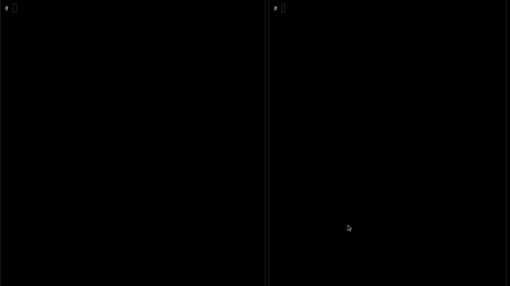

# evilBPF
_an eBPF / XDP Playground_

This repository contains a collection of eBPF / XDP programs that I've written while learning about eBPF and XDP. As security is my primary interest, most of these programs are security-related and are intended to be used for security research.


*Hide your files and processes from the system*


*Sniff unencrypted SSL/TLS traffic*

> [!WARNING]
> **Disclaimer:** I condemn the use of these programs for malicious purposes. I am not responsible for any damage caused by the use of these programs. These programs are intended for educational purposes only.

## Programs List

| Type | Name | Description | Notes |
| ---- | ---- | ----------- | ----- |
| XDP | [icmp_pingback](src/icmp_pingback) | Respond to ICMP echo requests with ICMP echo replies within the XDP layer. | Showcase of XDP program |
| TP | [hide_pid](src/hide_pid) | Hide a process (pid)/folder/file from the system | Inspired by [bad-bpf](https://github.com/pathtofile/bad-bpf) |
| TP | [hidden_ssh](src/hidden_ssh) | Give yourself a hidden backdoor in the SSH server | |
| UPROBE | [ssl_sniffer](src/ssl_sniffer) | Sniff unencrypted SSL/TLS traffic | |

## Requirements

For compiling eBPF programs, you'll need the following:

- Debian, Ubuntu, or other Debian-based Linux distribution
- Linux Kernel 5.8.0 or later
- `clang` and `llvm` (>= 10.0.0)

```bash
sudo apt install clang llvm libelf-dev linux-headers-$(uname -r) build-essential
```


## Installation

### From releases

You can download the latest release from the [releases page](https://github.com/rphang/evilBPF/releases).

> [!NOTE]
> Some programs might not give enough control over the eBPF program, if you need to modify the eBPF program, you'll need to compile the source code. (Or open an issue requesting the feature)

### Getting the source code

As we are using submodules, you'll need to clone this repository with the `--recursive` flag:

```bash
git clone https://github.com/rphang/evilBPF.git --recursive
```

If you've already cloned this repository without the `--recursive` flag, you can run the following command to clone the submodules:

```bash
git submodule update --init --recursive
```

### Compiling the programs

#### All at once

To compile all the programs at once, simply run the `Makefile` in the root directory:

```bash
make
```

All the compiled programs will be placed in the `dst` directory.

#### Individually
Each program has its own directory, and each directory has its own `Makefile`. To compile a program, simply `cd` into the program's directory and run `make`:

```bash
cd src/<program>...
make
```

## Resources

Alot of the general resources I've used to learn about eBPF and XDP are listed below:

- [libbpf-bootstrap: demo BPF applications](https://github.com/libbpf/libbpf-bootstrap) by [libbpf team](https://github.com/libbpf)
- [xdp-tutorial](https://github.com/xdp-project/xdp-tutorial) by [XDP-project team](https://github.com/xdp-project)
- [Simple eBPF CO-RE Application](https://www.sartura.hr/blog/simple-ebpf-core-application/) by Juraj Vijtiuk ([Sartura](https://www.sartura.hr/))